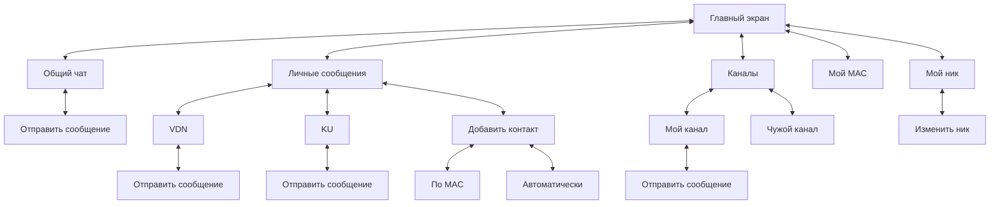
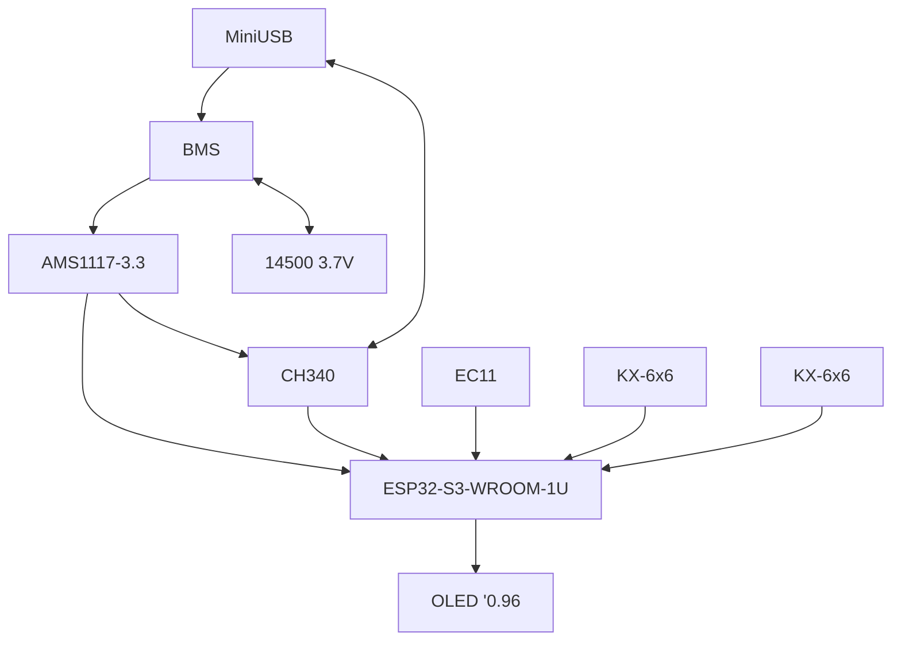

**ОНО НЕ РАБОТАЕТ**

# VDNGram

VDNGram - устройство для обмена сообщениями между обладателями данных устройств. Имеет общий чат, в котором можно отправить сообщение всем пользователям, написать опеределённому пользователю в личные сообщения, а также создать свой канал, который будет виден всем.

---

## Физическая форма

Устройство представляет из себя миниатюрную коробку, Имеющую экран и энкодер для взаимодействия с пользователем.

### Взаимодействие 

Для начала определим механизм взаимодействия с пользователем.

 <strong> Диаграмма опций пользователя </strong> 

### Электроника

Для упрощения монтаж аэлектронных компонентов будет использоваться печатная плата.

 Схема печатной платы 

### Корпус

Корпус устройства должен быть напечатан на 3D-принтере из PETG (PETG-CF) или PLA. Он должен быть разборным - плата должна сниматься.
